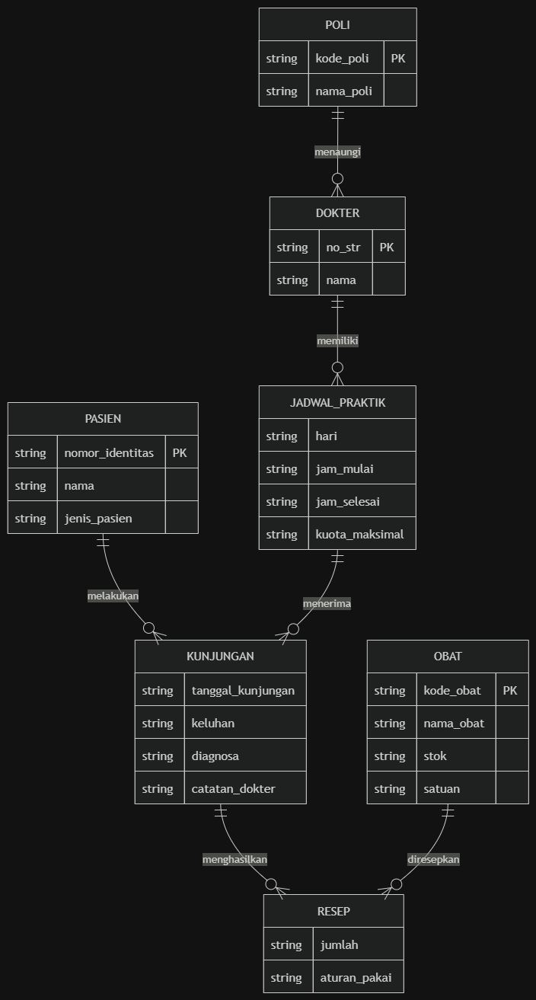
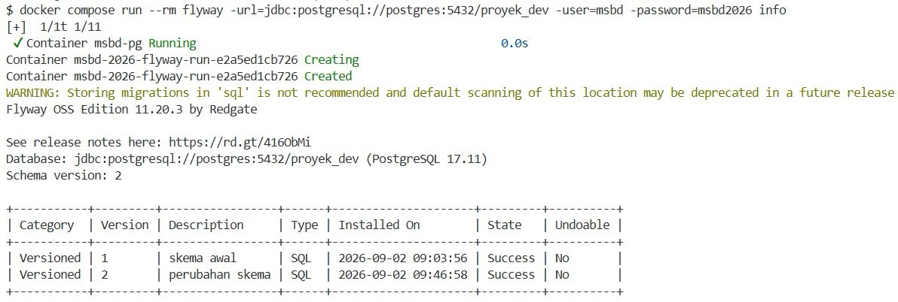
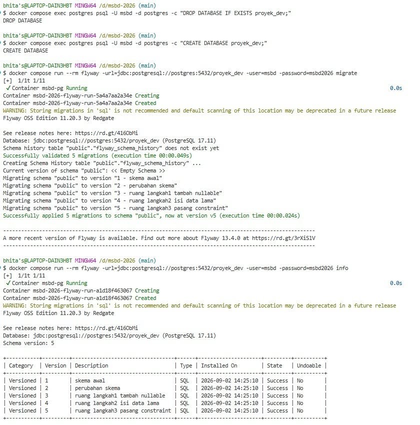

# Laporan MSBD Kelompok 3 - Latihan 2

### 1. Nama Domain dan Alasan Pemilihan Domain

* **Nama Domain:** Sistem Informasi Pelayanan dan Manajemen Klinik Kampus 
* **Alasan Pemilihan:**  
  Domain ini dipilih karena memiliki kompleksitas relasi data yang ideal untuk menerapkan perancangan basis data relasional: mencakup relasi satu-ke-banyak (poliklinik ke dokter, dokter ke jadwal), relasi banyak-ke-banyak dengan entitas asosiatif (kunjungan dengan obat melalui peresepan), serta integritas data yang ketat seperti batasan jam kerja dokter, validitas antrean, dan pelacakan stok obat.

---

### 2. Ringkasan Lingkup Sistem

Sistem ini difokuskan pada alur operasional pelayanan rawat jalan tingkat pertama di lingkungan kampus:

* **Termasuk dalam Lingkup (In-Scope):**
  * **Manajemen Master Data:** Pengelolaan unit poliklinik, legalitas dokter (`no_str`), dan identitas pasien dari civitas akademika (Mahasiswa, Dosen, Tendik).
  * **Penjadwalan Praktik:** Pengaturan alokasi hari, rentang jam kerja dokter, dan kuota antrean pasien per sesi jaga.
  * **Transaksi Kunjungan & Rekam Medis:** Pencatatan kedatangan pasien, nomor antrean harian, keluhan, diagnosa dokter, serta status layanan (`menunggu`, `diperiksa`, `selesai`, `batal`).
  * **Pelayanan Farmasi:** Pencatatan peresepan obat per kunjungan beserta aturan pakai dan pengurangan stok fisik obat di apotek klinik.
* **Tidak Termasuk dalam Lingkup (Out-of-Scope):**
  * Fasilitas rawat inap jangka panjang (*inpatient care*).
  * Penggajian atau remunerasi dokter dan staf.
  * Pengadaan obat skala pabrik/vendor besar.
  * Integrasi klaim asuransi kesehatan pihak ketiga.

---

### 3. Ringkasan Kebutuhan Data

Kebutuhan data diturunkan langsung dari dokumen kebutuhan data sistem:

* **Poli (`poli`):** Mengelola unit layanan spesialisasi dengan atribut identitas unik `kode_poli` dan `nama_poli`.
* **Dokter (`dokter`):** Menyimpan identitas tenaga medis dengan batasan unik pada `no_str` serta foreign key ke unit poli yang aktif.
* **Jadwal Praktik (`jadwal_praktik`):** Mengatur alokasi tugas dokter per hari dan jam praktik, kuota maksimal antrean, serta validasi logis jam selesai harus lebih besar daripada jam mulai.
* **Pasien (`pasien`):** Menyimpan identitas civitas akademika (`nomor_identitas` unik) dengan batasan klasifikasi jenis pasien: `Mahasiswa`, `Dosen`, atau `Tendik`.
* **Obat (`obat`):** Katalog persediaan farmasi klinik dengan kode unik, satuan kemasan, dan batasan integritas stok non-negatif (`stok >= 0`).
* **Kunjungan (`kunjungan`):** Entitas transaksi yang menghubungkan pasien dan jadwal dokter, mencatat tanggal berobat, nomor antrean, rekam medis (keluhan dan diagnosa), serta tahapan status alur layanan.
* **Resep (`resep`):** Entitas asosiatif pemecah relasi banyak-ke-banyak antara kunjungan dan obat, mencatat kuantitas obat (`jumlah > 0`) dan instruksi aturan pakai.

---

### 4. Penjelasan Singkat ERD



Basis data dirancang untuk menjaga integritas referensial dan memenuhi kaidah normalisasi:

* **Hierarki Layanan Medis (`poli` $\rightarrow$ `dokter` $\rightarrow$ `jadwal_praktik`):**  
  Satu poli menaungi satu atau lebih dokter (relasi *1:N*). Setiap dokter memiliki jadwal dinamis berdasarkan hari dan jam jaga dengan batasan kuota antrean pasien (relasi *1:N*).
* **Entitas Inti Transaksi (`kunjungan`):**  
  Menjadi jembatan utama transaksi rawat jalan yang menghubungkan entitas `pasien` dengan `jadwal_praktik`. Entitas ini menyimpan nomor antrean, tanggal pemeriksaan, keluhan pasien, status alur pemeriksaan, serta hasil diagnosa dokter.
* **Asosiasi Farmasi (`kunjungan` $\leftrightarrow$ `obat` melalui `resep`):**  
  Satu sesi kunjungan dapat menghasilkan beberapa resep obat, dan satu jenis obat dapat diresepkan ke banyak pasien (*M:N*). Relasi ini diselesaikan melalui entitas asosiatif `resep` yang mencatat jumlah obat (`jumlah > 0`) dan aturan pakainya.

  ---

  ### 5. Ringkasan Status Migration

Pengelolaan skema basis data dikendalikan penuh menggunakan Flyway melalui container Docker:

* **`V1__skema_awal.sql`**: Membuat struktur tabel master (`pasien`, `poli`, `dokter`, `jadwal_praktik`, `obat`).
* **`V2__perubahan_skema.sql`**: Membuat tabel transaksional pelayanan (`kunjungan`, `resep`).
* **`V3__ruang_langkah1_tambah_nullable.sql`**: Evolusi skema aman tahap 1 dengan menambahkan kolom `ruang` berkondisi *nullable*.
* **`V4__ruang_langkah2_isi_data_lama.sql`**: Evolusi skema aman tahap 2 berupa pengisian data default (*backfilling*) pada kolom `ruang`.
* **`V5__ruang_langkah3_pasang_constraint.sql`**: Evolusi skema aman tahap 3 dengan menerapkan constraint `NOT NULL` pada kolom `ruang`.

#### Status Riwayat Migrasi Flyway

| Version | Description | Type | State |
| :---: | :--- | :---: | :---: |
| **1** | skema awal | SQL | **Success** |
| **2** | perubahan skema | SQL | **Success** |
| **3** | ruang langkah1 tambah nullable | SQL | **Success** |
| **4** | ruang langkah2 isi data lama | SQL | **Success** |
| **5** | ruang langkah3 pasang constraint | SQL | **Success** |



#### Bukti Rebuild Database dari Nol
Pembangunan ulang database dilakukan secara otomatis dan deterministik dari skrip migrasi:



---

### 6. Bukti Database Dapat Dibangun Ulang Menggunakan Migration

Pengujian dilakukan untuk membuktikan bahwa skema database dapat dibangun kembali secara identik dan deterministik hanya menggunakan kumpulan file migrasi Flyway tanpa bergantung pada snapshot manual.

#### Langkah Eksekusi:
1. Menghapus database `proyek_dev` yang ada:
   ```bash
   docker compose exec postgres psql -U msbd -d postgres -c "DROP DATABASE IF EXISTS proyek_dev;"
2. Membuat ulang database kosongan:
   ```bash
   docker compose exec postgres psql -U msbd -d postgres -c "CREATE DATABASE proyek_dev;"
3. Menjalankan migrasi penuh dari awal:
   ```bash
   docker compose run --rm flyway migrate
   docker compose run --rm flyway info

---

### 7. Bukti Pola Tiga Langkah Penambahan Kolom NOT NULL

Penambahan kolom `ruang` pada tabel yang sudah memiliki data dilakukan bertahap melalui tiga migrasi terpisah guna menghindari kegagalan migrasi dan meminimalkan durasi penguncian tabel (*table locking*):

* **Langkah 1 (`V3__ruang_langkah1_tambah_nullable.sql`)**:  
  Menambahkan kolom baru berstatus *nullable* agar operasi DDL berjalan seketika tanpa perlu memvalidasi baris data lama.
  ```sql
  ALTER TABLE jadwal_praktik
  ADD COLUMN ruang varchar(50);
* **Langkah 2 (V4__ruang_langkah2_isi_data_lama.sql):
  Melakukan data backfilling untuk memperbarui seluruh baris eksisting yang masih bernilai NULL dengan nilai default.**:  
  ```sql
  UPDATE jadwal_praktik
  SET ruang = 'Ruang Pemeriksaan Umum'
  WHERE ruang IS NULL;
* **Langkah 3 (V5__ruang_langkah3_pasang_constraint.sql):
  Memasang constraint NOT NULL setelah seluruh baris dipastikan memiliki data yang valid.
  ALTER TABLE jadwal_praktik
  ALTER COLUMN ruang SET NOT NULL;

  ---

### 8. Hasil Seed Data Setelah Dijalankan Dua Kali

File seeder `latihan/p02/seeds/01_peran.sql` dirancang agar bersifat **idempoten** dengan memanfaatkan klausa `ON CONFLICT (...) DO NOTHING` atau `DO UPDATE`. Mekanisme ini memastikan skrip dapat dieksekusi berulang kali tanpa memicu galat duplikasi data (*unique constraint violation*) serta menjaga konsistensi isi basis data.

#### Perintah Eksekusi
```bash
# Eksekusi pertama untuk memasukkan data awal
docker compose exec -T postgres psql -U msbd -d proyek_dev < latihan/p02/seeds/01_peran.sql

# Eksekusi kedua untuk memverifikasi sifat idempoten
docker compose exec -T postgres psql -U msbd -d proyek_dev < latihan/p02/seeds/01_peran.sql
```

---

### 9. Pengamatan dari `pg_stat_activity` (Eksperimen Locking)

Eksperimen dilakukan untuk mengamati perebutan kunci tabel (*table lock contention*) antar-transaksi yang dieksekusi secara bersamaan melalui tiga sesi terminal terpisah.

#### Skenario Uji Tiga Terminal

* **Terminal 1 (Memegang Kunci Baca)**:  
  Membuka transaksi eksplisit untuk membaca data tanpa melakukan *commit*.
  ```sql
  BEGIN;
  SELECT count(*) FROM jadwal_praktik;
  -- Dibiarkan aktif tanpa mengeksekusi COMMIT atau ROLLBACK
* **Terminal 2 (Menunggu Kunci Eksklusif):
  Mencoba mengubah struktur tabel yang sedang dibaca oleh Terminal 1.
  ```sql
  ALTER TABLE jadwal_praktik ADD COLUMN catatan text;
  -- Perintah tertahan (blocking) dan tidak selesai
* **Terminal 3 (Monitoring Aktivitas Database):
  Memeriksa antrean proses dan jenis penantian (wait events) pada koneksi yang aktif.
  ```sql
  SELECT pid, wait_event_type, state, left(query, 60) AS query
  FROM pg_stat_activity
  WHERE datname = 'proyek_dev';
  ```
  
  ---

### 10. Jawaban Pertanyaan 1-7

### Pertanyaan 1
**Mengapa lingkungan pengujian memerlukan basis data sendiri, dan bukan sekadar schema terpisah di dalam basis data yang sama?**

> Lingkungan pengujian sebaiknya memiliki basis data sendiri agar data saat pengujian tidak bercampur atau mengganggu data dari lingkungan lain, terutama database development atau production. Selain itu, database terpisah membuat pengujian lebih aman karena data dapat diubah, dihapus, atau di-reset tanpa memengaruhi database utama.

### Pertanyaan 2
**Pilih satu kebutuhan yang memiliki aturan paling rumit. Menurut kelompok kalian, apakah aturan tersebut lebih tepat ditegakkan menggunakan constraint, trigger, atau kode aplikasi? Berikan satu alasan.**

> Menurut kelompok kami, kebutuhan yang memiliki aturan paling rumit lebih tepat ditegakkan menggunakan trigger. Alasannya, trigger dapat menjalankan aturan secara otomatis ketika terjadi perubahan data di dalam database, sehingga aturan tersebut tetap diterapkan meskipun data diubah dari aplikasi atau langsung melalui database

### Pertanyaan 3
  **Mengapa Peminjaman dan Unit Alat pada contoh tidak dihubungkan langsung, tetapi melalui Baris Pinjam? Apa yang hilang jika hubungan dibuat langsung?**

  > Peminjaman dan Unit Alat dihubungkan lewat Baris Pinjam karena satu peminjaman bisa mencakup beberapa unit alat sekaligus, dan satu unit bisa dipinjam berkali-kali di waktu berbeda. Baris Pinjam juga jadi tempat nyimpen kondisi tiap unit saat dipinjam dan dikembalikan. Kalau dihubungkan langsung, satu peminjaman cuma bisa nyatat satu unit, dan detail kondisi per unit itu jadi gak ada tempatnya.

### Pertanyaan 4
  **Apa perbedaan antara entitas Alat dan Unit Alat? Sebutkan satu pertanyaan bisnis yang hanya dapat dijawab jika keduanya dipisahkan.**

  > Alat itu jenis/model barangnya (misalnya "Mikroskop"), sedangkan Unit Alat itu barang fisiknya satu-satu, masing-masing punya kode dan status sendiri (tersedia/dipinjam/perbaikan). Ini perlu dipisah karena satu jenis alat bisa punya banyak unit dengan kondisi beda-beda. Contoh pertanyaan yang cuma bisa dijawab kalau dipisah: dari 5 mikroskop yang ada, berapa yang lagi bisa dipinjam sekarang?

### Pertanyaan 5
  **Seorang anggota kelompok mengubah isi V1__skema_awal.sql setelah migration tersebut sudah diterapkan, kemudian melakukan push ke repositori. Apa yang terjadi ketika anggota lain menjalankan migration? Jelaskan penyebab error dan cara memperbaikinya tanpa menghapus riwayat migration.**

  > yang terjadi adalah proses migrasi akan gagal dengan pesan Checksum mismatch. 
  
  Penyebab error : saat V1 pertama kali dijalankan, Flyway nyimpan nilai hash/checksum isi filenya ke dalam tabel flyway_schema_history. saat isi file V1 diubah dan di-push, nilai checksum di file baru tidak cocok lagi dengan riwayat di database. Flyway menganggap skrip tersebut udah dimodifikasi secara tidak sah sehingga migrasi dihentikan. 

  Cara memperbaiki (Tanpa Hapus Riwayat): 
  1. jalankan perintah repair untuk memperbarui nilai checksum di tabel riwayat biar sinkron sama file terbaru: bash "docker compose run --rm flyway repair" 
  2. jalankan ulang perintah migrasi: bash "docker compose run --rm flyway migrate"

### Pertanyaan 6
  **Catat apa yang terlihat pada`pg_stat_activity`. Perintah mana yang menunggu? Apa akibatnya jika kondisi tersebut terjadi pada basis data produksi saat banyak pengguna sedang mengakses sistem?**

  > Dari hasil `pg_stat_activity`, terlihat bahwa PID 3195 sedang menjalankan perintah `ALTER TABLE kunjungan` dan statusnya `active`, tetapi sedang menunggu `Lock` pada `relation`. Sementara itu, PID 830 berada dalam kondisi idle in transaction, yang berarti proses pada terminal 1 masih terbuka.

  Perintah yang menunggu adalah:
  `ALTER TABLE kunjungan`
  `ADD COLUMN catatan_lock text;`

  Hal ini terjadi karena transaksi pada terminal 1 masih memegang lock, sehingga perintah `ALTER TABLE` pada terminal 2 harus menunggu sampai lock tersebut dilepas. Kalau kondisi seperti ini terjadi di database produksi dan banyak pengguna sedang mengakses sistem, beberapa proses bisa ikut tertahan. Akibatnya, akses database menjadi lebih lambat, waktu tunggu pengguna meningkat, bahkan bisa terjadi timeout jika lock terlalu lama.

---

### Pembagian Tugas Tim

* **Tabhita Kristy Silitonga - 251402023 (PM)**  
  Mengatur alur kerja Git, menyiapkan `docker-compose.yml` (service Flyway), menyusun `kebutuhan.md`, mengeksekusi inisialisasi database (Langkah 1), serta menyusun dokumen akhir `laporan.md` dan `README.md`.

* **Jevine Jeje Zakarias Simanjuntak - 251402085**  
  Membuat migrasi V2__perubahan_skema.sql, mendokumentasikan bukti rebuild database, dan menjawab pertanyaan.

* **Fadila Lisma Sari - 251402117**  
  Mengerjakan migrasi evolusi skema 3-langkah (V3, V4, V5), eksperimen locking, mendokumentasikasn pg-stat-activity, serta menjawab pertanyaan.

* **Qairsya Naurel ein Yaliki - 251402120**  
  Menyusun skrip data awal yang idempoten di `seeds/01_peran.sql`, melakukan pengujian verifikasi seed data, menyusun panduan perintah CLI, serta menjawab pertanyaan

* **Reynald Alvaro Pasaribu - 251402147**  
  Mengerjakan ERD konseptual ke erd.png, serta merancang/membuat file migrasi/DDL awal V1__skema_awal.sql
