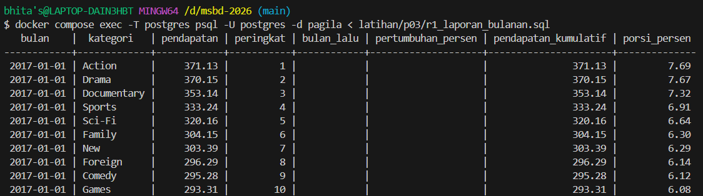

# Laporan Latihan Kelompok Pertemuan 3

## Anggota dan Kontribusi
| Nama | NIM | Kontribusi | Commit |
| :--- | :--- | :--- | :--- |
| Tabhita Kristy SIlitonga | 251402023 | Project Manager, Setup Lingkungan & Q00, R1 Laporan Bulanan, Finalisasi laporan & readme | ab2e387 |
| Jevine Jeje Zakarias Simanjuntak | 251402085 | Q10 – Q15 (+ Pertanyaan Reflektif C & Temuan Q14) | 39a4bb0 |
| Fadila Lisma Sari | 251402117 | Q01 – Q05 (+ Pertanyaan Reflektif A) | 732d962 |
| Qairsya Naurel ein Yaliki | 251402120 | Q16 – Q20 (+ Pertanyaan Reflektif D & E) | 889545b |
| Reynald Alvaro Pasaribu | 251402147 | Q06 – Q09 (+ Pertanyaan Reflektif B) | f2a7285 |

---

## Refleksi A - Subquery

**1. Pada Q4, apa tepatnya yang membuat NOT IN berbahaya, dan bagaimana memeriksa apakah sebuah kolom rawan terhadap masalah itu?**
> NOT IN bisa berbahaya jika hasil dari dari subquery mengandung nilai NULL. Karena NULL tidak dianggap sama dengan nilai apa pun, kondisi perbandingan ini dapat menjadi tidak pasti sehingga hasil query bisa salah atau tidak menampilkan data yang seharusnya. Untuk memeriksanya, kita dapat mengecek apakah kolom yang digunakan pada subquery memiliki nilai NULL, misalnya dengan COUNT(*) dan COUNT(nama_kolom). Jadi jika jumlahnya berbeda, yang berarti terdapat nilai NULL.

**2. Pada Q5, berapa kali subquery dievaluasi secara konseptual, dan mengapa "sekali per baris luar" belum tentu sama dengan yang benar-benar dikerjakan mesin?**
> Secara konseptual, subquery berkorelasi pada Q5 dianggap dievaluasi untuk setiap baris dari query luar karena menggunakan s.store_id dari baris luar. Namun, PosgreSQL tidak harus menjalankannya secara terpisah untuk setiap baris luar. Namun, PostgreSQL tidak harus menjalankannya secara terpisah untuk setiap baris. Query planner dapat mengoptimalkan atau mengubah cara eksekusinya sehingga jumlah evaluasi sebenarnya bisa berbeda dari konsep tersebut.

---

## Refleksi B - CTE dan Recursive CTE

**1. Pada Q7, mengapa recursive term hanya melihat baris yang baru dihasilkan pada iterasi sebelumnya, dan apa akibatnya jika ia melihat seluruh hasil?**
> Recursive term cuma lihat baris dari putaran sebelumnya (bukan semua hasil) karena memang gitu cara kerja UNION ALL di recursive CTE — tiap putaran cuma proses "yang baru ketemu kemarin". Kalau dia balik lagi ngecek semua hasil dari awal, jadinya boros dan bisa muncul baris ganda dari data yang harusnya udah kelar diproses.

**2. Kapan mengganti UNION ALL dengan UNION dapat menghentikan siklus, dan mengapa itu tetap bukan solusi yang baik?**
> Ganti UNION ALL jadi UNION bisa nyetop siklus kalau baris yang muter itu persis sama semua kolomnya — otomatis kebuang karena dianggap duplikat. Tapi ini bukan solusi bagus: pertama, Postgres jadi harus bandingin semua kolom tiap baris baru ke semua baris lama, lumayan berat. Kedua, kalau ada kolom yang nilainya selalu beda tiap putaran (kayak level atau jalur yang makin panjang), baris nggak akan pernah persis sama — jadi UNION gak bakal ketahuan ada siklus dan tetap infinite loop.

---

## Refleksi C - Window Function

**1. Pada Q14, berapa tanggal yang berbeda, dan sifat data apa pada tabel payment yang menyebabkan perbedaan?**
> Jumlah tanggal yang berbeda bisa dilihat dari hasil Q14. Perbedaannya terjadi karena data payment punya tanggal yang berurutan tapi jumlah transaksi tiap harinya beda. Q13 pakai frame ROWS, jadi rata-rata hanya mengambil 7 hari terakhir. Sedangkan Q14 tanpa frame pakai default RANGE, yang ngambil seluruh baris dari awal sampai tanggal tersebut, jadinya hasil rata-ratanya bisa berbeda.

**2. Jika Q13 menjadi laporan resmi keuangan, versi mana yang benar dan mengapa kesalahan frame sulit ditemukan melalui pengujian biasa?**
> yang benar untuk laporan Q13 adalah versi yang pakai ROWS BETWEEN 6 PRECEDING AND CURRENT ROW, karena memang ingin menghitung rata-rata 7 hari. Kesalahan frame susah ditemukan karena query tetap jalan dan hasilnya tetap terlihat masuk akal. Jadi secara teknis ga error, tapi makna angkanya sudah berbeda.

**3. Pada Q15, apa yang terjadi pada total belanja jika ORDER BY ditambahkan ke dalam OVER tanpa menuliskan frame?**
> Kalau ORDER BY ditambahkan tanpa frame, total belanja tidak lagi nunjukin total seluruh belanja pelanggan di setiap baris. PostgreSQL akan memakai frame default RANGE ... CURRENT ROW, jadinya nilainya menjadi total kumulatif sampai pembayarannya. Jadi totalnya bisa berbeda-beda di setiap baris, bukan sama untuk semua pembayaran pelanggan.

---

## Refleksi D - Agregasi dan Operasi Himpunan

**​1. Pada Q16, tanpa GROUPING(), bagaimana pembaca membedakan subtotal dari baris data yang kolomnya memang kosong?**
​> Tanpa GROUPING(), nilai NULL yang dihasilkan oleh ROLLUP (sebagai penanda subtotal atau grand total) akan terlihat identik dengan data asli di database yang memang bernilai NULL. Fungsi GROUPING() mengembalikan nilai 1 khusus untuk baris hasil agregasi subtotal, sehingga kita dapat mengubahnya secara eksplisit menjadi label yang jelas seperti 'SEMUA'.

**2. Pada Q17, mengapa versi FILTER dan CASE WHEN dapat memberi rata-rata berbeda walaupun jumlah baris sama?**
> Perbedaan terjadi karena cara penanganan nilai yang tidak memenuhi syarat kondisi. Pada klausa FILTER, baris yang tidak memenuhi kondisi disingkirkan sebelum kalkulasi AVG() dilakukan, sehingga jumlah penyebut (pembagi) tetap tepat. Pada CASE WHEN, jika kondisi tidak terpenuhi dan menghasilkan angka 0 (bukan NULL), nilai 0 tersebut akan tetap dihitung ke dalam penyebut saat kalkulasi AVG(), yang menyebabkan hasil rata-rata menjadi lebih kecil dari seharusnya.

---

## Refleksi E - JSONB
**1. Dari nomor transaksi, status, jumlah, dan identitas pelanggan di dalam payload, mana yang sebaiknya dipromosikan menjadi kolom relasional dengan constraint dan mana yang tepat tetap berada di JSON? Berikan alasan untuk setiap pilihan.**
> Dipromosikan ke Kolom Relasional (dengan Constraint):
Nomor Transaksi: Menggunakan constraint PRIMARY KEY atau UNIQUE + NOT NULL untuk menjamin identitas unik transaksi dan mempercepat kueri pencarian.
Jumlah: Menggunakan tipe data NUMERIC + NOT NULL + CHECK (jumlah >= 0) agar presisi finansial terjamin, perhitungan agregasi (SUM, AVG) berjalan cepat, dan mencegah input bernilai negatif.
Status: Menggunakan constraint NOT NULL + CHECK (status IN ('pending', 'lunas', 'batal')) atau ENUM untuk efisiensi indeks B-Tree serta menjaga validasi alur kerja operasional.
Tetap Berada di Dalam JSON:
Identitas Pelanggan (Detail/Snapshot): Tetap disimpan dalam JSON karena memiliki struktur yang fleksibel (schema drift), opsional, dan berfungsi sebagai snapshot histori data pada saat transaksi terjadi tanpa perlu mengubah skema tabel utama jika ada penambahan atribut di masa mendatang.

---

## Temuan Q14

---

## Hasil R1

---

## Tautan Merge Request
https://github.com/tabhitaksilitonga/MSBD-Kel.-3/pull/2
---
