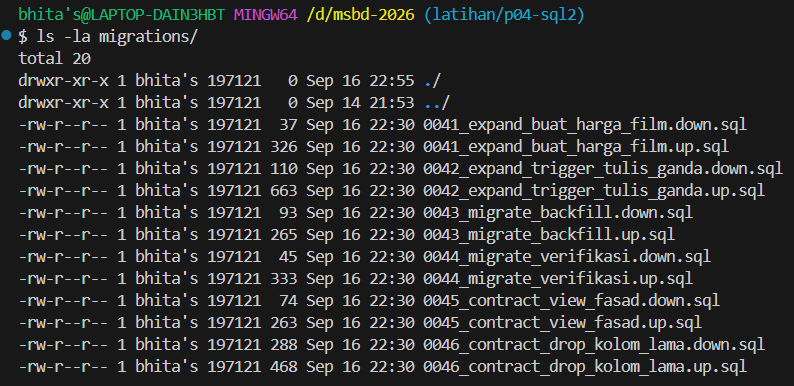

# Q21: Migrasi Berversi dan Rollback

## Enam Tahap Migrasi Berversi
Pola migrasi expand-contract diimplementasikan ke dalam berkas SQL berpasangan up dan down pada direktori `migrations/`:

1. **0041 - Expand Buat Tabel Baru**
   - `0041_expand_buat_harga_film.up.sql`: Membuat tabel baru `lab4.harga_film` beserta constraint rentang tanggal.
   - `0041_expand_buat_harga_film.down.sql`: Menghapus tabel `lab4.harga_film`.
2. **0042 - Expand Trigger Tulis Ganda**
   - `0042_expand_trigger_tulis_ganda.up.sql`: Membuat fungsi dan trigger tulis ganda dari `lab4.film` ke `lab4.harga_film`.
   - `0042_expand_trigger_tulis_ganda.down.sql`: Menghapus trigger dan fungsi tulis ganda.
3. **0043 - Migrate Backfill**
   - `0043_migrate_backfill.up.sql`: Menyalin data lama ke struktur baru dalam potongan 1000 baris.
   - `0043_migrate_backfill.down.sql`: Membersihkan baris hasil backfill pada tabel baru.
4. **0044 - Migrate Verifikasi**
   - `0044_migrate_verifikasi.up.sql`: Memeriksa baris yang belum termigrasi (harus mengembalikan 0).
   - `0044_migrate_verifikasi.down.sql`: Tidak memerlukan aksi rollback skema (query analitik).
5. **0045 - Contract View Fasad**
   - `0045_contract_view_fasad.up.sql`: Membuat view fasad untuk kompatibilitas aplikasi lama.
   - `0045_contract_view_fasad.down.sql`: Menghapus view fasad.
6. **0046 - Contract Drop Kolom Lama**
   - `0046_contract_drop_kolom_lama.up.sql`: Menghapus kolom `rental_rate` dari tabel `lab4.film`.
   - `0046_contract_drop_kolom_lama.down.sql`: Menambahkan kembali kolom `rental_rate` (struktur saja tanpa data).

## Struktur Berkas Migrasi

## Catatan Rollback
Berkas `0046_contract_drop_kolom_lama.down.sql` tidak dapat memulihkan data asli yang telah terhapus. Eksekusi file down hanya mengembalikan kolom kosong. Oleh sebab itu, tahap 0046 bersifat destruktif dan baru boleh dijalankan setelah pembaca lama diverifikasi beralih sepenuhnya ke view fasad.